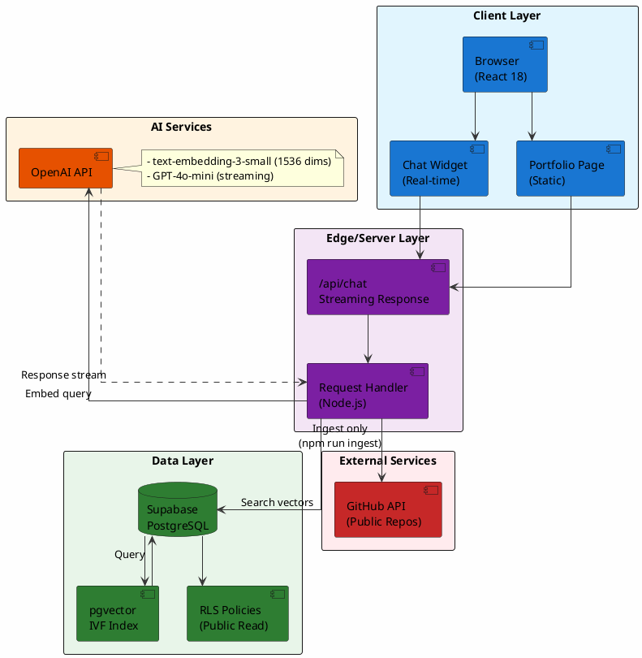
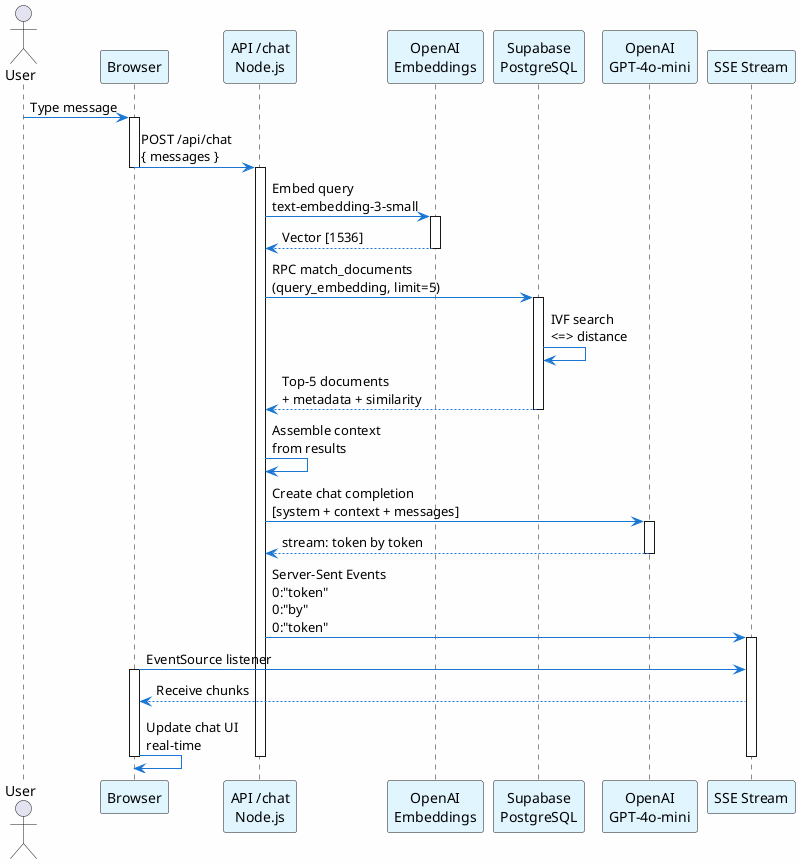
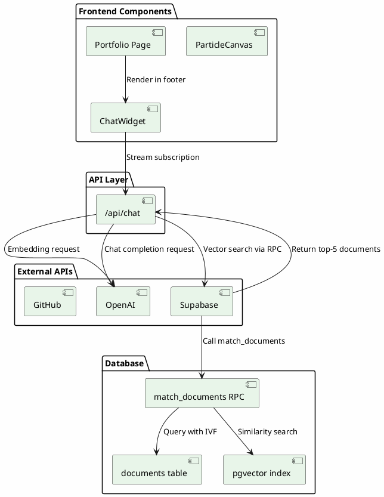
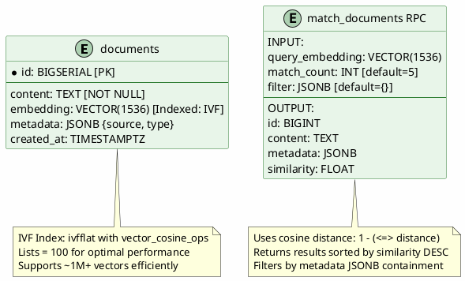
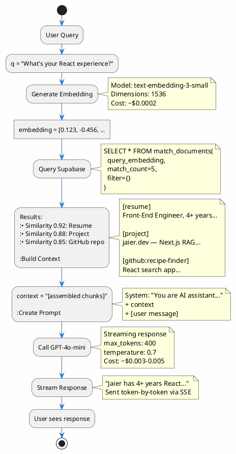
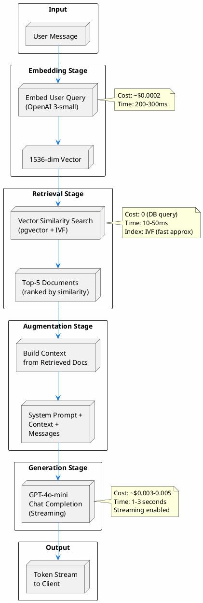
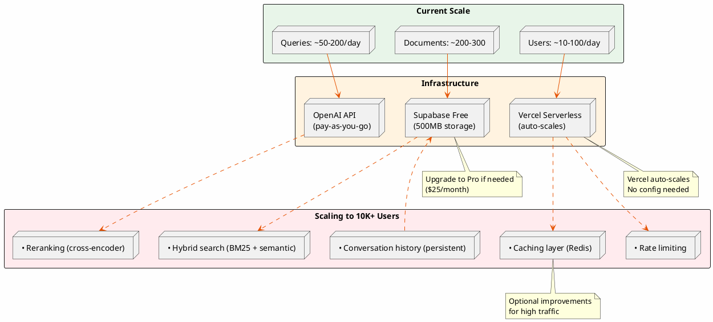

# Architecture Diagrams (PlantUML)

All diagrams below are in PlantUML format. Render them at:
- **Online**: [PlantUML Editor](https://www.plantuml.com/plantuml/uml/)
- **CLI**: `plantuml diagram.puml -o output.png`
- **VS Code**: Install PlantUML extension

---

## 1. System Architecture Overview



---

## 2. Chat Request Flow (Sequence Diagram)



---

## 3. Knowledge Base Ingestion Pipeline

```plantuml
@startuml IngestionPipeline
skinparam backgroundColor #FEFEFE
skinparam NodeBackgroundColor #FFF3E0
skinparam ArrowColor #E65100

start
:Delete all documents;
:Load Resume;
:Chunk text\n(500 words, 80 overlap);
:Embed chunks\n(OpenAI 1536-dims);
:Insert to DB\n(metadata: resume);

:Load About;
:Chunk text;
:Embed chunks;
:Insert to DB\n(metadata: about);

:Fetch GitHub repos\n(@username);
loop For each repo
  :Fetch README;
  :Fetch package.json;
  :Combine metadata;
  :Chunk content;
  :Embed chunks;
  :Insert to DB\n(metadata: github:repo);
  :Wait 300ms\n(rate limit);
end loop

:Log completion;
stop

@enduml
```

---

## 4. Component Interaction Diagram



---

## 5. Database Schema Diagram



---

## 6. Data Flow: Supabase to GPT



---

## 7. Deployment Pipeline

```plantuml
@startuml DeploymentPipeline
skinparam backgroundColor #FEFEFE
skinparam ArrowColor #E65100

rectangle "Local Development" #FFF3E0 {
  node "Git Clone\nInstall Dependencies" as local
  node "npm run dev\nhttp://localhost:3000" as dev
}

local --> dev

dev --> git[git push to GitHub]

rectangle "GitHub" #E3F2FD {
  node "Repository\njaierg/jaier-dev" as repo
}

git --> repo

repo --> vercel[Vercel CI/CD Pipeline]

rectangle "Vercel Build" #F3E5F5 {
  node "1. Install\nnpm install" as install
  node "2. Build\nnpm run build" as build
  node "3. Test\nNext.js validation" as test
  node "4. Deploy\nPush to edge" as deploy
}

vercel --> install
install --> build
build --> test
test --> deploy

rectangle "Production" #E8F5E9 {
  node "Vercel Edge Network\n(200+ locations)\njaier.dev" as prod
  node "Auto-scaling\n99.99% SLA" as sla
}

deploy --> prod
prod --> sla

@enduml
```

---

## 8. Environment Configuration Flow

```plantuml
@startuml EnvironmentConfig
skinparam backgroundColor #FEFEFE
skinparam nodeBackgroundColor #FFF3E0

rectangle "Local Development" {
  node ".env.local" as local_env
  local_env : OPENAI_API_KEY=sk-...
  local_env : NEXT_PUBLIC_SUPABASE_URL=...
  local_env : NEXT_PUBLIC_SUPABASE_ANON_KEY=...
  local_env : SUPABASE_SERVICE_ROLE_KEY=...
  local_env : GITHUB_TOKEN=...
}

rectangle "Vercel Production" {
  node "Environment Variables\n(Encrypted)" as prod_env
  prod_env : OPENAI_API_KEY=sk-...
  prod_env : NEXT_PUBLIC_SUPABASE_URL=...
  prod_env : NEXT_PUBLIC_SUPABASE_ANON_KEY=...
}

local_env --> "Used by: npm run ingest"
local_env --> "Used by: npm run dev"

prod_env --> "Used by: Vercel Edge Functions"
prod_env --> "Used by: API Routes"

note bottom of local_env
  ⚠️ NEVER commit .env.local
  Add to .gitignore
end note

note bottom of prod_env
  ✓ Service role key NOT needed
  ✓ Only public anon key deployed
  ✓ Secrets encrypted at rest
end note

@enduml
```

---

## 9. RAG Pipeline Architecture



---

## 10. Scalability Architecture



---

## How to Use These Diagrams

### Option 1: Online Rendering (Recommended)
1. Go to [PlantUML Editor](https://www.plantuml.com/plantuml/uml/)
2. Copy any diagram code above
3. Paste into editor
4. Click "Submit"
5. Download as PNG/SVG

### Option 2: Local Rendering
```bash
# Install PlantUML
brew install plantuml

# Render a diagram
plantuml ARCHITECTURE_DIAGRAMS.md -o diagrams/

# View output
open diagrams/
```

### Option 3: VS Code Extension
1. Install "PlantUML" extension
2. Open this file
3. Press `Alt+D` to preview
4. Right-click → Export as PNG/SVG

---

## Diagram Legend

| Symbol | Meaning |
|--------|---------|
| `→` | Synchronous request |
| `-.->` | Asynchronous / Optional |
| `[Box]` | System component |
| `(Circle)` | Start/End |
| `{Entity}` | Database table |
| `#Color` | Component type |

---

**All diagrams updated for system version 1.0 (June 2024)**
